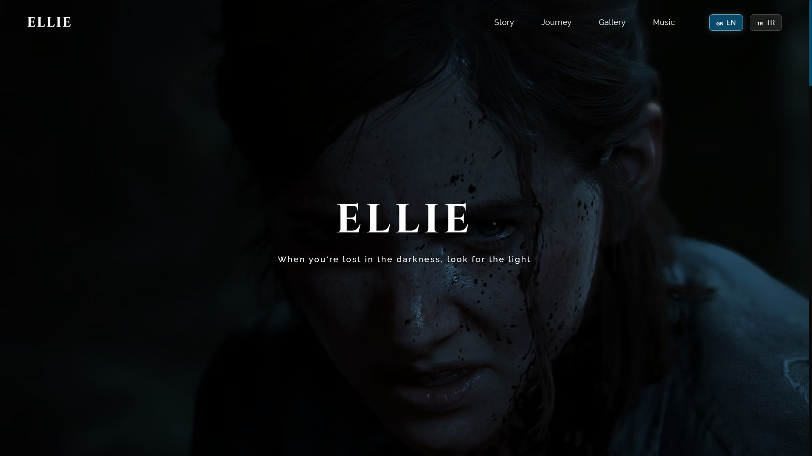

# The Last of Us - Fan Website 🎮

Modern ve interaktif bir The Last of Us fan websitesi.

A modern and interactive The Last of Us fan website.

## 🌟 Özellikler | Features
- Responsive tasarım | Responsive design
- Türkçe/İngilizce dil desteği | Turkish/English language support
- Smooth animasyonlar ve ışık efektleri | Smooth animations and light effects
- Modern timeline sistemi | Modern timeline system
- Dinamik müzik bölümü | Dynamic music section

## 🛠️ Kullanılan Teknolojiler | Technologies Used
- HTML5
- CSS3
- JavaScript
- AOS (Animate On Scroll)

## 🎨 Önizleme | Preview

## 🔗 Canlı Demo | Live Demo
[Siteyi Ziyaret Et | Visit the Site](https://hhydraaa.github.io/thelastofus)

## 👨‍💻 Geliştirici | Developer
Batuhan Eroğlu

## 📝 Lisans | License
Bu proje [MIT](LICENSE) lisansı altında lisanslanmıştır.

This project is licensed under the [MIT](LICENSE) License.
